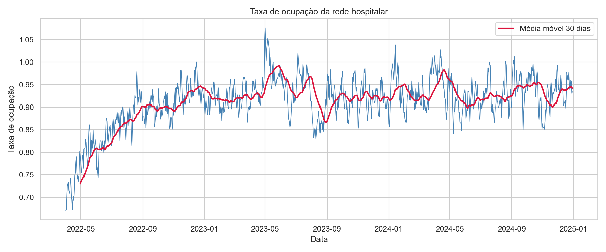
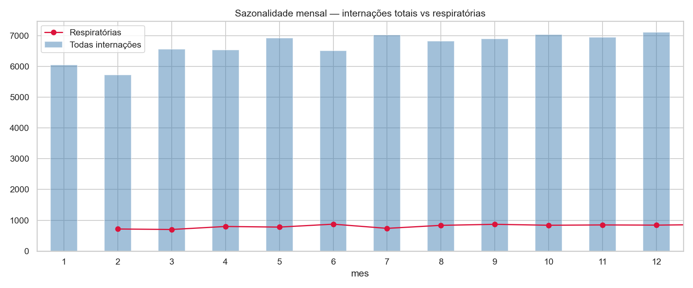
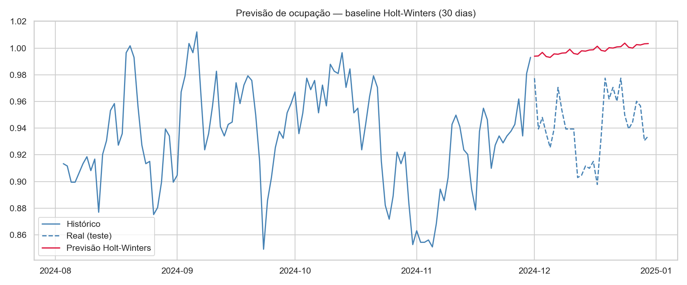
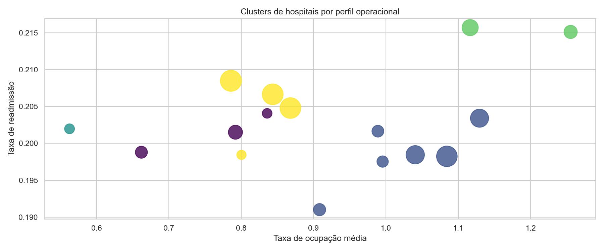
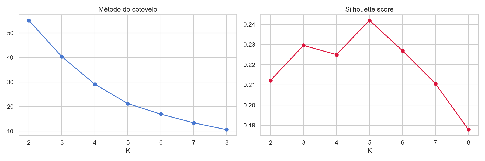
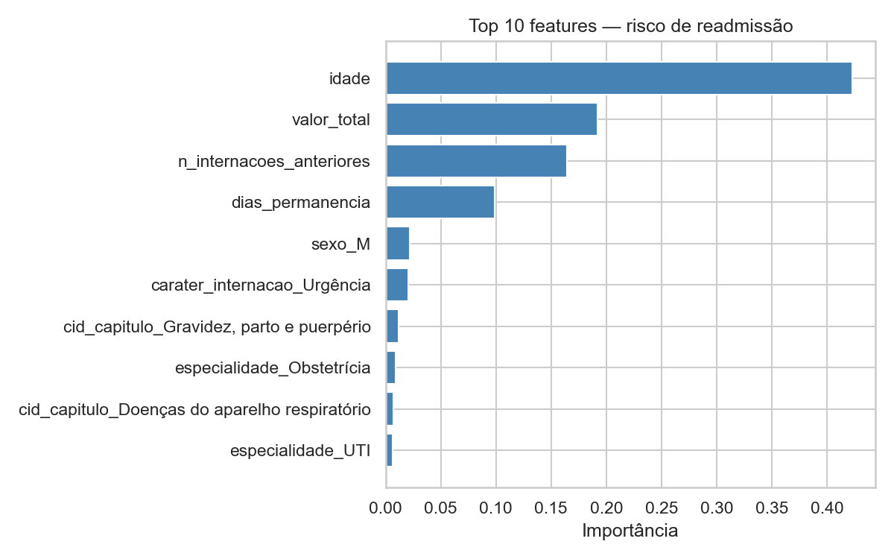

# BI de Saúde Hospitalar e Otimização de Leitos


Projeto de ciência de dados para apoiar a gestão de leitos hospitalares: previsão de demanda, classificação de risco de readmissão e segmentação de hospitais por perfil operacional.

## Contexto

Hospitais sofrem com superlotação, alta taxa de readmissão e má gestão de leitos — três problemas que se alimentam entre si. Um hospital sem previsão de demanda não sabe quando vai faltar leito. Sem um sinal de risco de readmissão, dá alta sem priorizar acompanhamento pós-alta para quem mais precisa. Sem visão consolidada por perfil operacional, trata cada unidade da rede como um caso isolado, mesmo quando o problema é sistêmico.

Este projeto usa séries temporais, classificação e clusterização para atacar as três frentes ao mesmo tempo, sobre uma rede simulada de 16 hospitais e 80 mil internações ao longo de três anos.

## Resultados esperados

Com base na literatura de gestão hospitalar e nos resultados obtidos no dataset simulado, esse tipo de pipeline reduz superlotação ao antecipar picos de ocupação, direciona acompanhamento pós-alta para os pacientes de maior risco e concentra investimento nos hospitais que realmente precisam — em vez de tratar toda a rede da mesma forma.

## Tecnologias utilizadas

- Python 3.10+
- Prophet e suavização exponencial (statsmodels) para previsão de demanda
- scikit-learn (Random Forest, regressão logística, K-Means)
- pandas + pyarrow para o pipeline de dados
- Jupyter Notebook

## Datasets

Os dados de referência do projeto são o SIH (Sistema de Internações Hospitalares) do DATASUS e os indicadores hospitalares da WHO. Como os microdados do SIH exigem baixar e descomprimir arquivos `.dbc` de um FTP — não trivial de reproduzir em qualquer máquina —, o projeto usa um gerador que simula internações com a mesma estrutura de campos e relações estatísticas plausíveis. Para detalhes completos, incluindo como plugar os dados reais quando disponíveis, consulte o **[Guia de Dados](data/README.md)**.

- **DATASUS — SIH** — Sistema de Internações Hospitalares do SUS, dados reais de internação por estado, município e procedimento.
- **WHO — Global Health Observatory** — indicadores hospitalares agregados por país, usados como benchmark.

## Estrutura do projeto

```
bi-saude-hospitalar/
    data/
        raw/            internações e cadastro de hospitais (simulados)
        processed/      dados limpos e bases prontas para modelagem
        external/       fontes externas (benchmarks da WHO)
    notebooks/
        01_eda.ipynb
        02_limpeza_e_features.ipynb
        03_previsao_demanda_leitos.ipynb
        04_risco_readmissao.ipynb
        05_clusterizacao_hospitais.ipynb
    src/
        data/           gerador do dataset simulado, ingestão e limpeza
        features/       engenharia de features (ocupação, indicadores, risco)
        models/         previsão de demanda, classificação de risco, clusterização
        visualization/  geração de gráficos
    reports/
        figures/        imagens geradas durante a análise
        relatorio_final.md
    tests/
        test_pipeline.py
    requirements.txt
    README.md
```

## Como executar

**1. Clone o repositório**

```bash
git clone https://github.com/dudumelo98/bi-saude-hospitalar.git
cd bi-saude-hospitalar
```

**2. Crie o ambiente virtual**

```bash
python -m venv venv
source venv/bin/activate  # Windows: venv\Scripts\activate
```

**3. Instale as dependências**

```bash
pip install -r requirements.txt
```

**4. Gere o dataset simulado**

```bash
python -m src.data.gerar_dataset_simulado
```

**5. Execute os notebooks em ordem**

Comece pelo `01_eda.ipynb` para entender os dados antes de rodar qualquer modelo. O notebook `03_previsao_demanda_leitos.ipynb` treina o modelo de produção com Prophet, que exige `pip install prophet` — o baseline com suavização exponencial no mesmo notebook funciona sem essa dependência.

## Indicadores de desempenho monitorados

- Tempo Médio de Permanência
- Taxa de Readmissão em 30 dias
- Taxa de Ocupação de Leitos
- Rotatividade de Leitos
- Taxa de Mortalidade (proxy operacional de gravidade dos casos)

## Modelos implementados

| Modelo | Uso | Métrica principal |
|---|---|---|
| Holt-Winters (statsmodels) | Baseline de previsão de ocupação | MAE, MAPE |
| Prophet | Previsão de demanda por leitos (produção) | MAE, MAPE |
| Regressão Logística | Baseline interpretável de risco de readmissão | AUC, Recall |
| Random Forest | Classificação de risco de readmissão | AUC, Recall, F1 |
| K-Means | Clusterização de hospitais por perfil operacional | Silhouette Score |

## Resultados obtidos no dataset simulado

- Previsão de ocupação (baseline Holt-Winters, 30 dias): **MAPE de 6,1%**
- Risco de readmissão (Random Forest): **AUC de 0,60**, recall de 0,53
- Clusterização: **5 perfis operacionais**, do "equilibrado" ao "crise aguda de leitos"

Detalhamento completo em [reports/relatorio_final.md](reports/relatorio_final.md).

## Limitações conhecidas

Os resultados vêm de um dataset simulado — servem para validar a metodologia e o pipeline, não como diagnóstico de uma rede hospitalar real. O classificador de risco de readmissão usa só dados administrativos, sem comorbidades ou histórico clínico detalhado, o que limita o teto de desempenho do AUC.

## Próximos passos

- Validar o pipeline com uma amostra real do SIH de um estado
- Incluir índice de comorbidades (Charlson ou Elixhauser) no modelo de readmissão
- Avaliar a previsão de ocupação em horizontes mais longos (60-90 dias)
- Construir um painel Power BI consumindo as tabelas de `data/processed/`

## Visualizações

Geradas automaticamente ao executar os notebooks e salvas em `reports/figures/`.

**Taxa de ocupação da rede hospitalar**



**Sazonalidade mensal — internações totais vs respiratórias**



**Previsão de ocupação — baseline Holt-Winters**



**Clusters de hospitais por perfil operacional**



**Escolha de K — cotovelo e silhouette**



**Importância das features — risco de readmissão**



## Autor

- **Duilio Melo** - [GitHub](https://github.com/dudumelo98)

## Licença

MIT
